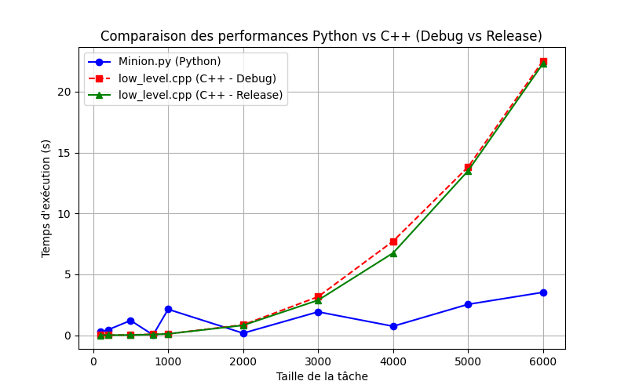

# Multi-Threading Task Manager

## Objectif
Ce projet vise à comparer les performances du calcul parallèle entre **Python** et **C++** pour la résolution de systèmes linéaires (Ax = b).

## Description
Le projet met en place un gestionnaire de tâches multi-threading basé sur un système client-serveur :

- Un **Boss** distribue les tâches.
- Des **Minions** les exécutent.
- Un **Proxy HTTP** facilite la communication client-serveur.

## Architecture

### Structure des fichiers

#### Python :
- `Boss.py` : Classe qui gère la création et l'envoi de tâches aux minions.
- `Minion.py` : Classe représentant un minion qui exécute les tâches.
- `QueueManager.py` : Gère les files d'attente pour les tâches et les résultats.
- `proxy.py` : Interface HTTP pour interagir avec le système.

#### C++ :
- `low_level.cpp` : Résolution de systèmes linéaires avec Eigen et communication HTTP via cpr.

## Prérequis

### Python
- **Python 3.x**
- Bibliothèques requises :
  ```bash
  uv add numpy httpx
  ```

### C++
- Un **compilateur compatible avec C++17** (GCC/Clang).
- Bibliothèques requises :
  ```bash
  sudo apt-get update
  sudo apt-get install -y cmake g++ libssl-dev nlohmann-json3-dev
  ```

## Installation

### 1. Exécuter le script `setup.sh`
```bash
chmod +x setup.sh
./setup.sh
```
Ce script installe les dépendances

## Compilation et Exécution

### Automatiquement via `start.sh`

```bash
chmod +x setup.sh
./start.sh
```

Ce script :
- Vérifie les dépendances
- Compile le code C++
- Lance tous les services (Boss, Minion, QueueManager, Proxy, low_level.cpp)

### 1. Manuellement : Côté Python

**Démarrer le gestionnaire de files** :
```bash
uv run QueueManager.py
```

**Lancer le Proxy HTTP** :
```bash
uv run proxy.py
```

**Envoyer des tâches** :
```bash
uv run Boss.py
```

**Lancer les travailleurs** :
```bash
uv run Minion.py
```

### 2. Manuellement : Côté C++

**Démarrer le gestionnaire de files** :
```bash
uv run QueueManager.py
```

**Lancer le Proxy HTTP** :
```bash
uv run proxy.py
```

**Compilation** :
```bash
cmake -B build -S . -DCMAKE_BUILD_TYPE=Release
cmake --build build
```

**Exécution du Minion C++** :
```bash
./build/low_level
```

## Analyse comparative des performances

### Comparaison des performances Python vs C++



Comme le montre le graphique ci-dessus :
- **Python (Minion.py) est globalement plus rapide que C++ (low_level.cpp), même pour les grandes tailles de matrices.**
- **C++ est plus performant uniquement pour les très petites tailles de matrices.**
- Cette performance de Python est due au fait que **NumPy est optimisé en C et bénéficie d'algorithmes hautement optimisés pour les opérations matricielles.**
- **Malgré les optimisations en C++, Python surpasse C++ sur la plupart des tailles de matrices.**

## Conclusion
Ce projet met en évidence un fait surprenant : **malgré les optimisations en C++, Python est globalement plus rapide que C++ pour ces types de calculs**. Cette performance inattendue s'explique par le fait que **NumPy est massivement optimisé en C** et tire parti d'algorithmes spécialisés pour la manipulation de matrices. Toutefois, **C++ reste intéressant pour des tâches très spécifiques nécessitant un contrôle bas niveau**, mais pour des calculs matriciels classiques, **Python est clairement plus performant**.

## Auteurs
- **Alexis Gibert**
- **Nour Ghiloufi**

Projet réalisé dans le cadre des enseignements de **multithreading** de l'**UPSSITECH**.
